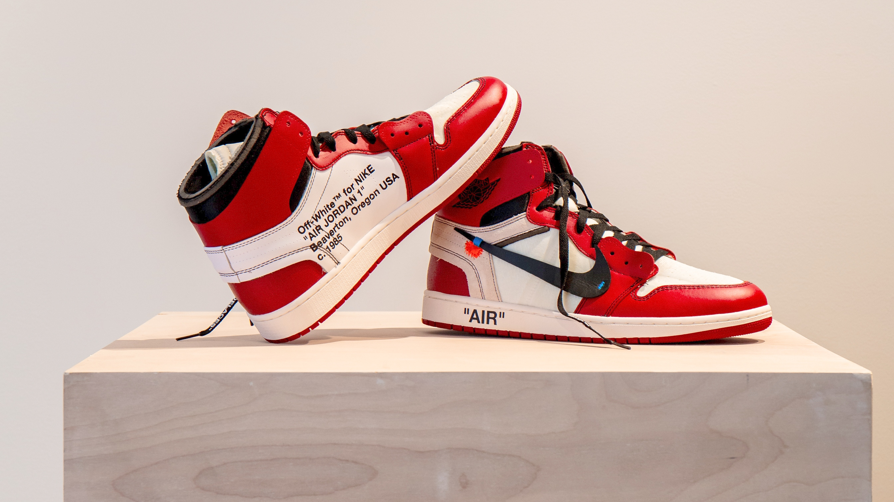

<!DOCTYPE html>
<html lang="en">
<head>
    <meta charset="UTF-8">
    <meta name="viewport" content="width=device-width, initial-scale=1.0">
    <title>Papuci Site</title>
    <link rel="stylesheet" href="style.css">
</head>
<body>
    <header>
        <h1>Papuci de Calitate</h1>
    </header>
    <main>
        <section>
            <h2>Modelele Noastre</h2>
            

                
                <h3>Papuci Model 1</h3>
                
Descriere scurtă a papucilor model 1.

            

            

                
                <h3>Papuci Model 2</h3>
                
Descriere scurtă a papucilor model 2.

            

        </section>
    </main>
    <footer>
        
&copy; 2024 PapuciSite. Toate drepturile rezervate.

    </footer>
    
</body>
</html>
